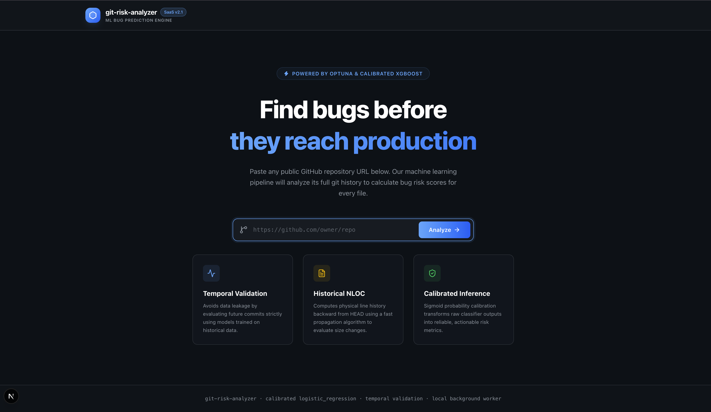
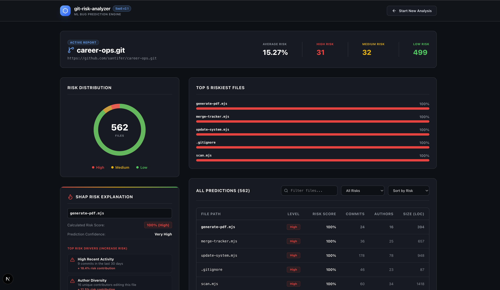

# ⬡ Git Risk Analyzer

<div align="center">

[](https://nextjs.org)
[](https://fastapi.tiangolo.com)
[](https://scikit-learn.org)
[](https://xgboost.ai)
[](LICENSE)

### **ML-powered bug prediction for any GitHub repository**

Predict which files are most likely to contain bugs using machine learning trained on **873K+ commits** across **15 major open-source repositories**.

</div>

---

# 📸 Preview

| Landing Page | Analysis Dashboard |
|:------------:|:-----------------:|
|  |  |

---

# ✨ Core Features

* 🔮 **Calibrated Bug Risk Prediction**: Sigmoid calibration maps raw machine learning scores into meaningful probabilities.
* 🧠 **Optimized Machine Learning**: XGBoost models hyperparameter-tuned with Optuna, alongside Random Forest and Logistic Regression baselines.
* ⚡ **High-Speed Git Mining**: Uses optimized single-branch cloning and parses commit details in linear $O(N)$ speed.
* 🏷️ **SZZ-Inspired Bug Labeling**: Analyzes bug-fixing commits to track back and identify bug-inducing modifications.
* 📈 **Historical NLOC (Lines of Code)**: Uses a fast backward-propagation algorithm to calculate historical file lengths without expensive git blob downloads.
* 📊 **Interactive Next.js Dashboard**: Polling progress screens, custom responsive SVG donut charts, search/filter panels, and **SHAP Explainability Badges** showing positive/negative risk contributors.

---

# 🏗️ Architecture Flow

```text
               [ Next.js Frontend ] (Port 3000)
                        │
                        ▼ (Axios / Fetch API)
               [ FastAPI Backend ] (Port 8000)
                        │
         ┌──────────────┴──────────────┐ (BackgroundTasks)
         ▼                             ▼
   [ Git Extractor ]            [ Predictor ]
   ├── Optimized Clone          ├── Load model/saved_model.pkl
   ├── O(N) Git Miner           └── Run calibrated inference
   ├── SZZ Bug Labeler
   └── Backward NLOC Propagation
```

---

# 📂 Project Structure

```text
git-risk-analyzer/
│
├── backend/
│   ├── main.py        # FastAPI endpoints (/api/analyze, /api/jobs/{id})
│   └── tasks.py       # Asynchronous background analysis worker tasks
│
├── frontend/
│   ├── src/app/
│   │   ├── page.tsx   # React client-side landing and dashboard page
│   │   ├── layout.tsx # Root layout
│   │   └── icon.tsx   # Dynamic SVG favicon generator
│   └── package.json
│
├── extractor/
│   ├── clone_repo.py     # Optimized single-branch git cloner
│   ├── commit_miner.py   # Fast-miner & backward NLOC propagator
│   ├── labeler.py        # Optimized SZZ-inspired bug labeler
│   └── run_all.py        # Multi-repo miner runner
│
├── features/
│   └── build_dataset.py  # File-level aggregations (churn, author, age)
│
├── model/
│   ├── train.py          # Optuna hyperparameter tuner & model selector
│   ├── predict.py        # Local prediction CLI
│   ├── evaluate.py       # Metrics plot generator (ROC, PR, SHAP)
│   └── saved_model.pkl   # Serialized ML model bundle
│
├── img/                  # UI Preview screenshots
├── requirements.txt      # Backend Python dependencies
└── README.md             # Project overview
```

---

# 🚀 Quick Start (Local Run)

### 1. Run the FastAPI Backend
Start the backend server on `http://127.0.0.1:8000`:
```bash
# Set up venv and install dependencies
python -m venv venv
source venv/bin/activate  # venv\Scripts\activate on Windows
pip install -r requirements.txt

# Start FastAPI
uvicorn backend.main:app --host 127.0.0.1 --port 8000 --reload
```

### 2. Run the Next.js Frontend
Start the frontend development server on `http://localhost:3000`:
```bash
# Go to frontend and start dev
npm run dev --prefix frontend
```
Open `http://localhost:3000` in your browser.

---

# 🧪 CLI Pipeline (Local Dataset Building)
If you want to re-train the model or compile new datasets locally:

1. **Mine and label training repositories**:
   ```bash
   python extractor/run_all.py --workers 3
   ```
2. **Compile features dataset**:
   ```bash
   python features/build_dataset.py
   ```
3. **Train and Calibrate ML models**:
   ```bash
   python model/train.py
   ```

---

# 📄 License

This project is licensed under the **MIT License**.