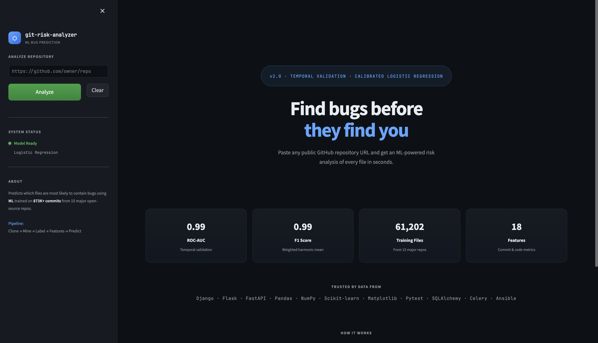
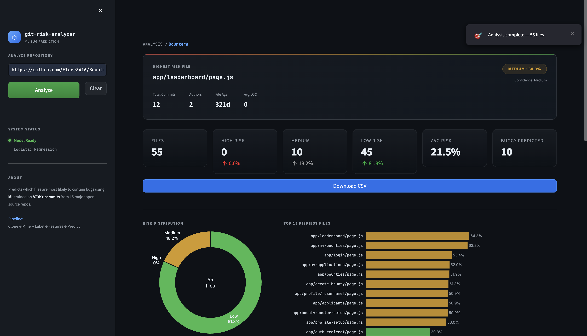

# ⬡ Git Risk Analyzer

<div align="center">

[](https://python.org)
[](https://streamlit.io)
[](https://scikit-learn.org)
[](https://xgboost.ai)
[](LICENSE)

### **ML-powered bug prediction for any GitHub repository**

Predict which files are most likely to contain bugs using machine learning trained on **873K+ commits** across **15 major open-source repositories**.

</div>

---

# 📸 Preview

| Landing Page | Analysis Dashboard |
|:------------:|:-----------------:|
|  |  |

---

# ✨ Features

- 🔮 **Calibrated Bug Risk Prediction**
  - Produces reliable probabilities instead of raw model scores.

- ⏳ **Temporal Validation**
  - Trains only on historical data and evaluates on future commits.
  - Prevents data leakage.

- 🏷️ **SZZ-Inspired Bug Labeling**
  - Labels bug-inducing commits instead of bug-fixing commits.

- ⚡ **High-Speed Git Mining**
  - Uses `git log --numstat`
  - ~100× faster than traditional per-commit diff mining.

- 🧠 **Optimized Machine Learning**
  - Logistic Regression
  - XGBoost
  - Optuna Hyperparameter Optimization
  - Probability Calibration (Sigmoid)

- 📊 **Interactive Dashboard**
  - Streamlit
  - Plotly
  - GitHub-inspired dark UI
  - Repository-wide risk analysis

- 📈 **Production-Oriented Pipeline**
  - Automatic repository cloning
  - Feature engineering
  - Prediction
  - CSV export

---

# 🏗 Pipeline

```text
        GitHub Repository
                │
                ▼
        ┌────────────────┐
        │ Clone Repository│
        └────────────────┘
                │
                ▼
        ┌────────────────┐
        │ Commit Mining  │
        └────────────────┘
                │
                ▼
        ┌────────────────┐
        │ SZZ Labeling   │
        └────────────────┘
                │
                ▼
        ┌────────────────┐
        │ Feature Builder│
        └────────────────┘
                │
                ▼
        ┌────────────────┐
        │ ML Prediction  │
        └────────────────┘
                │
                ▼
       Risk Report + Dashboard
```

---

# ⚙ Pipeline Stages

| Stage | Description |
|--------|-------------|
| **Clone** | Clone any public GitHub repository |
| **Mine** | Extract complete commit history using `git log --numstat` |
| **Label** | Apply SZZ-inspired temporal bug labeling |
| **Features** | Aggregate file-level metrics such as churn, authors, age and recency |
| **Train** | Temporal split + Optuna tuning + Probability Calibration |
| **Predict** | Predict bug probability for every repository file |
| **Dashboard** | Interactive visual analytics and risk exploration |

---

# 📂 Project Structure

```text
git-risk-analyzer/
│
├── dashboard/
│   └── app.py
│
├── extractor/
│   ├── clone_repo.py
│   ├── commit_miner.py
│   ├── labeler.py
│   └── run_all.py
│
├── features/
│   └── build_dataset.py
│
├── model/
│   ├── train.py
│   ├── predict.py
│   ├── evaluate.py
│   └── saved_model.pkl
│
├── data/
│   ├── repos/
│   ├── *_commits.csv
│   ├── *_labeled.csv
│   ├── *_features.csv
│   └── predictions.csv
│
├── img/
│   ├── Preview_1.png
│   └── Preview_2.png
│
├── requirements.txt
└── README.md
```

---

# 🚀 Installation

## Clone Repository

```bash
git clone https://github.com/yourusername/git-risk-analyzer.git

cd git-risk-analyzer
```

## Create Virtual Environment

```bash
python -m venv venv
```

### Windows

```bash
venv\Scripts\activate
```

### macOS / Linux

```bash
source venv/bin/activate
```

## Install Dependencies

```bash
pip install -r requirements.txt
```

---

# 📦 Requirements

- Python 3.11+
- Streamlit
- Plotly
- Pandas
- NumPy
- Scikit-learn
- XGBoost
- Optuna
- GitPython
- PyDriller
- Rich
- SHAP

---

# 🧠 Train the Model

Mine repositories

```bash
python extractor/run_all.py --workers 3
```

Build features

```bash
python features/build_dataset.py
```

Train

```bash
python model/train.py
```

Example output

```text
Best model : logistic_regression
ROC-AUC    : 0.9945
PR-AUC     : 0.7728
Brier      : 0.0092

Saved → model/saved_model.pkl
```

---

# 🖥 Launch Dashboard

```bash
streamlit run dashboard/app.py
```

Open

```
http://localhost:8501
```

Paste any public GitHub repository URL to begin analysis.

---

# 📈 Model Performance

| Metric | Score |
|--------|-------:|
| ROC-AUC | **0.9945** |
| PR-AUC | **0.7728** |
| Brier Score | **0.0092** |
| Weighted F1 | **0.9851** |

### Training Data

- 873K+ commits
- 61K+ files
- 15 open-source repositories

Repositories include:

- Django
- Flask
- FastAPI
- Pandas
- NumPy
- Scikit-learn
- Matplotlib
- Pytest
- SQLAlchemy
- Celery
- Ansible
- Requests
- HTTPX
- Click
- Rich

---

# 🧪 CLI Prediction

Run

```bash
python model/predict.py
```

Example

```text
==================================================
Git Risk Analyzer — Inference
==================================================

Total Files      : 61,202
Predicted Buggy  : 671
Predicted Clean  : 60,531

HIGH Risk        : 365
MEDIUM Risk      : 467
LOW Risk         : 60,370

Average Risk     : 2.00%
```

---

# 🔬 Design Decisions

### Temporal Validation

Training always uses older commits while testing uses newer commits to simulate real-world prediction.

---

### SZZ-Inspired Labeling

Bug-fixing commits are traced back to identify the original bug-inducing commit.

---

### Probability Calibration

Raw classifier outputs are calibrated using sigmoid scaling, producing meaningful probabilities.

---

### Fast Git Mining

Uses

```text
git log --numstat
```

instead of expensive per-commit parsing, providing significant speed improvements.

---

### Feature Engineering

Features include:

- Commit frequency
- Code churn
- Number of contributors
- File age
- Recent activity
- Average LOC
- Commit density
- Bug history
- Author diversity
- File recency
- Temporal statistics

---

# 🛣 Roadmap

- [ ] SHAP explanations inside dashboard
- [ ] GitHub Action for pull request comments
- [ ] Cross-project validation
- [ ] Deep-learning baseline (TabNet / FT-Transformer)
- [ ] Repository comparison mode
- [ ] Historical risk trends

---

# 📄 License

This project is licensed under the **MIT License**.

---

<div align="center">

**Built with ❤️ using Streamlit, Scikit-learn, XGBoost and Git**

</div>