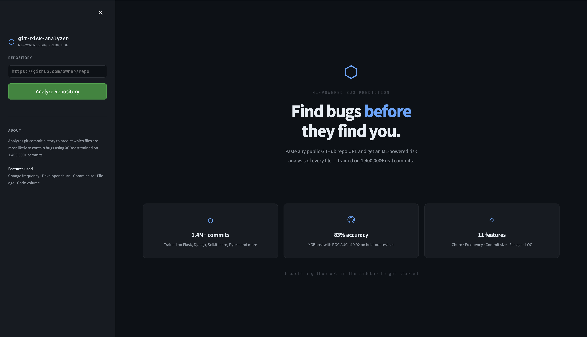

# Git Risk Analyzer

<p align="center">
	<b>Predict risky files in a GitHub repository before bugs surface.</b>
</p>

Git Risk Analyzer is an ML-powered app that mines commit history from a public GitHub repository, builds file-level engineering features, and predicts which files are most likely to be buggy. The project includes a Streamlit dashboard for interactive analysis and a trained model for scoring repository files.

## What it does

- Clones a public GitHub repository.
- Mines commit history and labels buggy commits.
- Builds a feature set for every file.
- Runs a trained model to assign a risk score.
- Displays the riskiest files in a clean Streamlit dashboard.

## Getting Started

### 1. Install dependencies

```bash
pip install -r requirements.txt
```

### 2. Run the dashboard

```bash
streamlit run dashboard/app.py
```

### 3. Analyze a repository

Paste any public GitHub repo URL into the sidebar and click **Analyze Repository**.

## How it works

The pipeline is split across three stages:

1. `extractor/` clones repositories, mines commits, and labels bug-inducing changes.
2. `features/` builds the tabular dataset used by the model.
3. `model/` trains and evaluates the classifier, then saves the final bundle in `model/saved_model.pkl`.

The dashboard then loads that model and renders a ranked view of file risk scores.

## Landing Page Preview



## Project Structure

```text
main.py
dashboard/app.py
extractor/
features/
model/
data/
img/
```

## Data Notes

The following large commit datasets are intentionally kept out of the README workflow notes and are manually ignored in `.gitignore`:

- `data/airflow_commits.csv`
- `data/core_commits.csv`
- `data/keras_commits.csv`
- `data/fastapi_commits.csv`
- `data/ansible_commits.csv`

Other generated files such as feature CSVs under `data/*_features.csv` are produced on the fly by the dashboard.

## Model Inputs

The current model uses repository/file-level signals such as:

- commit frequency
- recent commit activity
- developer churn
- ownership concentration
- lines added and deleted
- file age
- code volume

## Tech Stack

- Python
- Streamlit
- pandas
- scikit-learn
- XGBoost
- Plotly

## Notes

- The dashboard expects `model/saved_model.pkl` to be present.
- The repository works best with public GitHub URLs.
- Generated commit and feature files live under `data/`.
